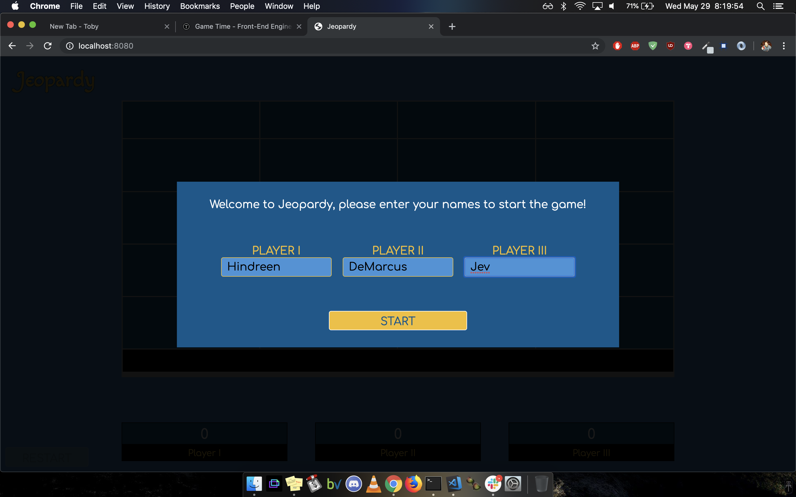
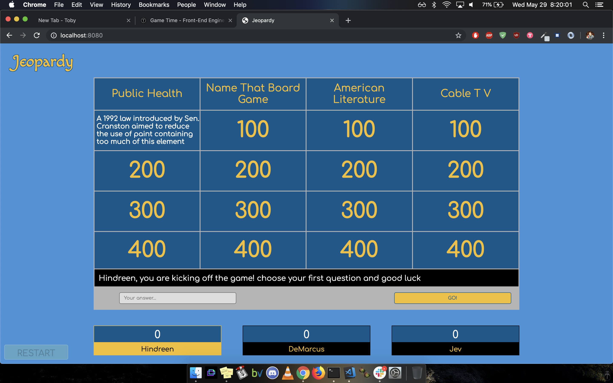
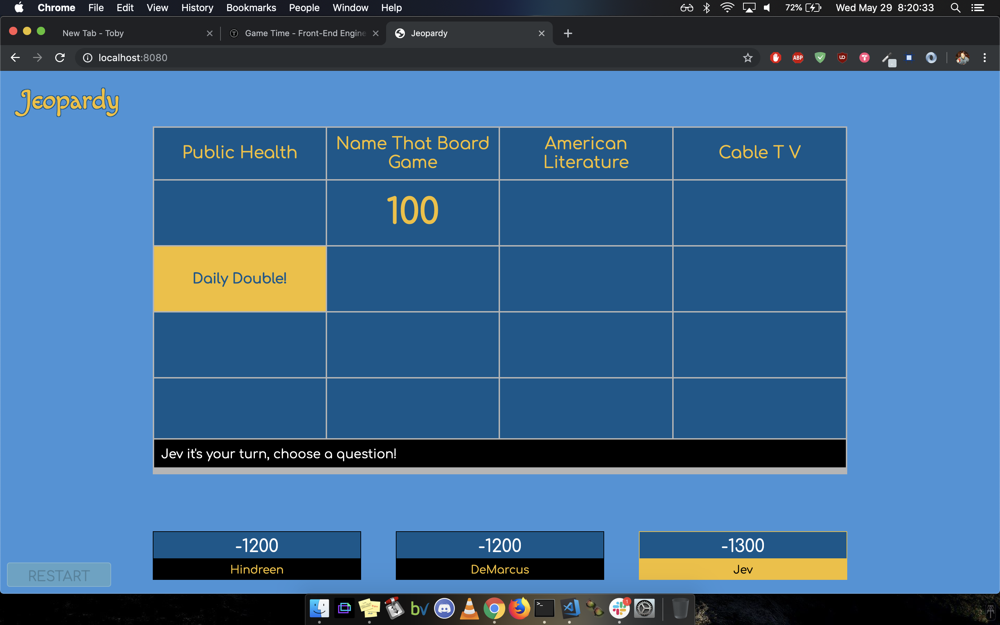

# It's Jeopardy!!!

This is our version of the worldwide famous, and hugely popular, Jeopardy! Fetching from a trivia API, we consume the data, clean it, and build out a fully functional, 3 round, Jeopardy! game that can be played online. We made this game with 4 developers in total, so leaning heavily into project managment tools, conducting daily stand-ups, concrete scheduling, pair-programming, and a commitment to always having open, honest, and healthy communication was key to this project's incredible success.

We wanted to continue honing our vanilla JS and jQuery chops, so writing modular, easy-to-read data and DOM manipulation was at the forefront of our thought-processes. We finished this game in a week - a few days before we planned to, and used the final few days to refactor, polish, and clean our code.

## Getting Started

1. Clone the repo.
2. Set up the dependancies by running `npm install`
3. Start playing around with the game... Good luck!

### Prerequisites

You'll need a modern windows, linux, or OS X machine, able to run the dependancies.

## Running the tests

There are a comprehensive set of mocha/chai tests for all classes, properties, and methods.

Set up the dependancies by running `npm install`

Run tests by typing `npm test` in your terminal in your cloned directory.

### Goals and Objectives

- Follow the specification [here](http://frontend.turing.io/projects/module-2/game-time.html) to make a working game.
- Implement ES6 classes that communicate to each other as needed.
- Write modular, reusable code that attempts to adhere to the following principles: the Open/Closed Principle, Liskov Substitution Principle, Interface Segregation Principle, Dependency Inversion Principle, and Test Driven Development.
- Implement a robust testing environment using Mocha and Chai.
- Use object and array prototype methods to perform rich data manipulation.
- Display information on the page while maintaining ability to test class properties and methods.
- Create a gameboard that is easy to follow and displays information in a clear and fun way.

## Authors

* **DeMarcus Kirby** - *Initial work* - [KirbyDD](https://github.com/KirbyDD)

* **Hindreen Fawzi** - *Initial work* - [hndfaw](https://github.com/hndfaw)

* **Jev Forsberg** - *Initial work* - [baldm0mma](https://github.com/baldm0mma)

## License

This project is licensed under the MIT License - see the [LICENSE.md](LICENSE.md) file for details.
